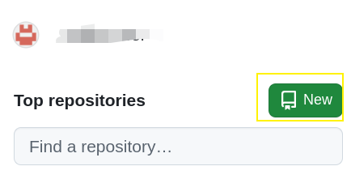
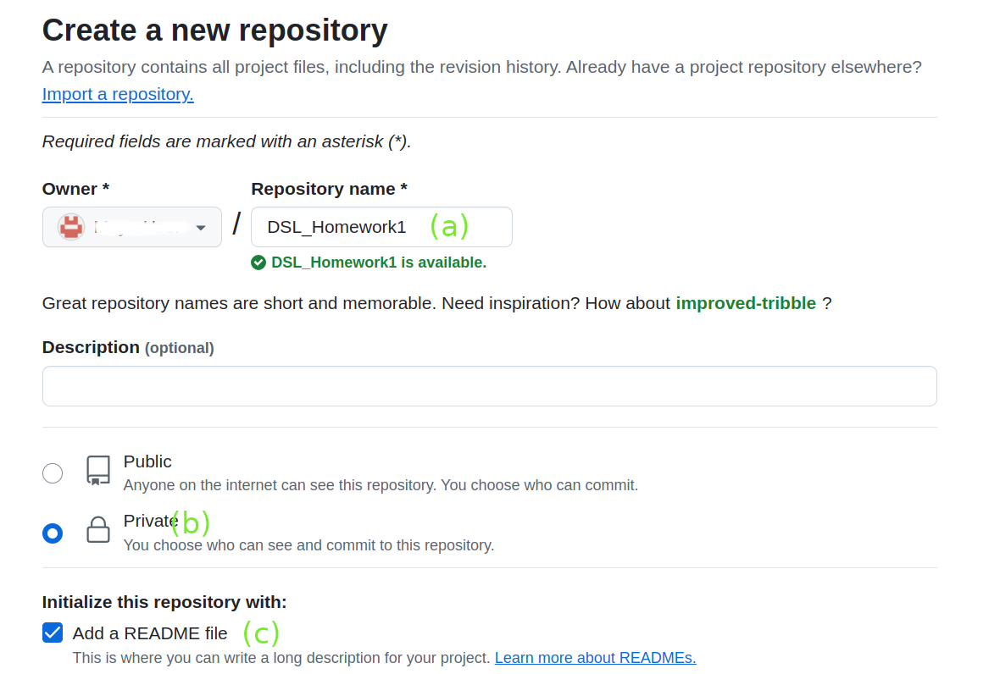
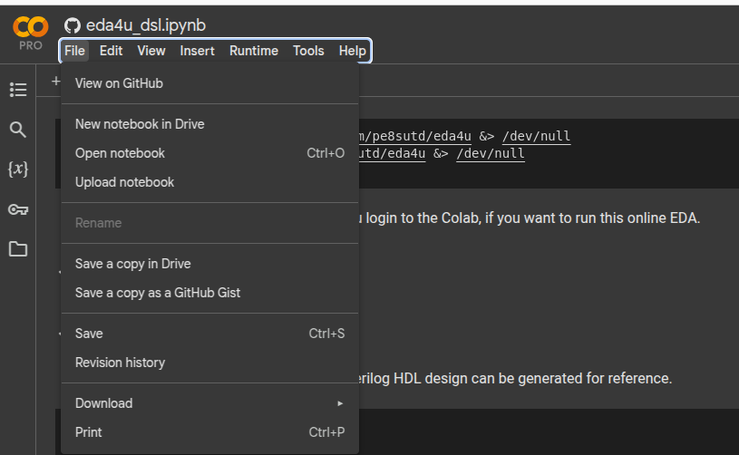
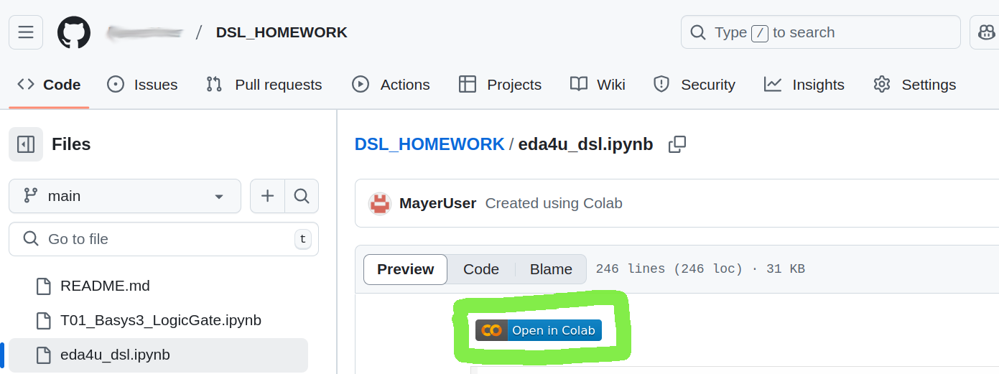
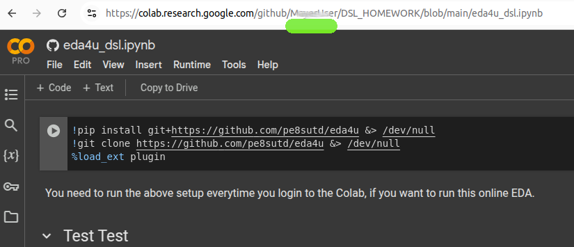
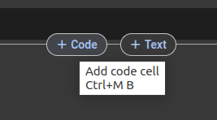
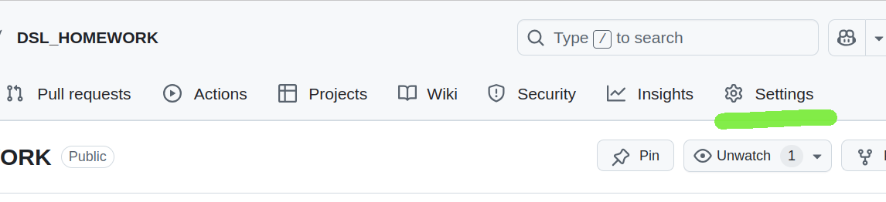
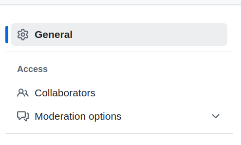
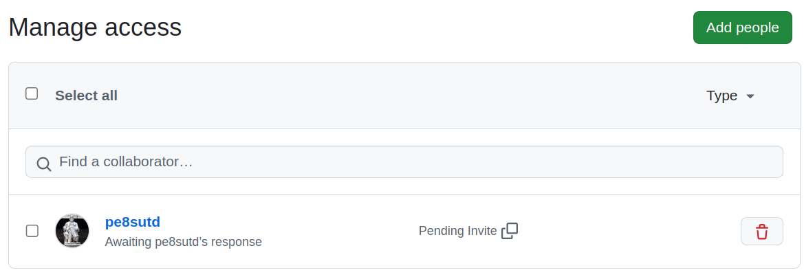

# DSL Colab Handson Repo

Welcome to the **DSL Colab Handson Repo**! This repository contains hands-on projects designed for learning Digital System Lab (DSL) using FPGA development boards. The projects range from foundational logic gate implementations to more advanced peripherals and applications. These labs are ideal for students, hobbyists, and enthusiasts looking to explore FPGA development with Xilinx Vivado and Digilent boards.

---

## Projects Overview

### 1. **T01_Basys3_LogicGate**  
   - **Description**: Implement basic logic gates (AND, OR, NOT) on the Basys3 FPGA board. Learn Vivado workflow and I/O constraints.  
   - **Skills**: Vivado project setup, constraint files, basic digital logic.  

### 2. **T02_Basys3_StopWatch**  
   - **Description**: Design a digital stopwatch with reset functionality using the Basys3 board.  
   - **Skills**: Sequential logic, seven-segment display control.  

### 3. **T03_Cmod_UART_ADC**  
   - **Description**: Interface a Cmod FPGA board with an ADC (Analog-to-Digital Converter) and communicate data via UART.  
   - **Skills**: UART communication, ADC interfacing, peripheral integration, finite state machines (FSMs).  

### 4. **T04_CmodA7_PRNG**  
   - **Description**: Implement a pseudo-random number generator (PRNG) on the Cmod A7 FPGA board.  
   - **Skills**: PRNG algorithms, clock management, hardware testing.  

---

## Repository Structure

```plaintext
/
├── T01_Basys3_LogicGate.ipynb               # Jupyter notebook guide for Project 1
├── T02_Basys3_StopWatch.ipynb               # Jupyter notebook guide for Project 2
├── T03_Cmod_UART_ADC.ipynb                  # Jupyter notebook guide for Project 3
├── T04_CmodA7_PRNG.ipynb                    # Jupyter notebook guide for Project 4
├── Simulation/                              # Verilog Simulation on Colab T01,T02,T03
│   ├── simT01_Basys3_LogicGate.ipynb           # Verilog Simulation for T01   
│   ├── simT02_Basys3_StopWatch.ipynb           # Verilog Simulation for T02   
│   ├── simT03_Cmod_UART_ADC.ipynb              # Verilog Simulation for T03
├── Demo_Code/                               # Pre-built code examples for all projects
│   ├── T01_Basys3_LogicGate/                # Demo Code for T01   
│   ├── T02_Basys3_StopWatch/                # Demo Code for T02   
│   ├── T03_Cmod_UART_ADC/                   # Demo Code for T03
│   ├── basys3_template.xdc                  # Basys3 Constrain File Template;
│   ├── cmoda7_template.xdc                  # CmodA7 Constrain File Template;
├── Other_Document/                          # Supplementary guides
│   ├── O1_Install_Vivado_Environment.pdf    # Vivado installation tutorial
│   ├── O2_Vivado_Project_Guideline.pdf      # Step-by-step project setup
│   ├── O3_FPGA_Program_Flash_Tutorial.pdf   # Programming FPGA flash memory
│   └── O4_PCB_CMODA7_Tutorial.pdf           # Cmod A7 PCB usage guide
└── figures/                                 # Diagrams and screenshots for documentation
```


---


## DSL User Guide - Getting Started with Colab Verilog Simulation

### Github + Colab Preparation
1. Please sign up for a [Github account](https://github.com/);

2. Create a new Repo with Readme file; 

3. Configure your repo as follows:

   (a) Repo Name;

   (b) "Private";

   (c) Enable "Add a README file";

   

   4. Open the Colab Practice from Google classroom;
   5. "File" -> "Save" 
   6. If you have not link your Colab to your Github account, there will be a pop-up window for log-in;
   7. Select the repo for your DSL homework;
   8. Enable "Include a link to Colab";
   9. The web page will redirect to your Github Repo;
   10. Click "Open in Colab"; 
   11. Check the domain of Page, which should be same with Github user name; 

### Usage of Colab 

You have insert a `Code` Block instead of `Text` Block in your notebook to run the program. There are 3 Verilog HDL blocks can be used for analysis and simulation purpose. 

#### Block `%%print_verilog`

This block is used to generate the RTL level schematic of giving module; 

```
%%print_verilog # This is compulsory, which indicate this block is used for `print_verilog`

//The module under analysis;
//--my 2 inputs and gate--//
module my_and2(
    output F,
    input a,
    input b);

  assign F = (a&b);

endmodule
//-----//
```

#### Block `%%verilog`

This block is used to run the simulation; Please notice:

1. If there are anything changes in `print_verilog`, please manually update in `verilog` block;
2. In this example, `my_and2_tb` is testbench instance name;
3. In this example, Wire `F_tb` is a object under `my_and2_tb`;
4. In this example, Reg `a_tb` ,`b_tb` are objects under `my_and2_tb`;
5. In this example,  Dump File name is "my_and2_tb.vcd"

```
%%verilog # This is compulsory, which indicate this block is used for `verilog`

// If there is anything change in `print_verilog`, please manually update in `verilog` block;
//--my 2 inputs and gate--//
module my_and2 (
    output F,
    input a,
    input b);

  assign F = (a&b);

endmodule
//-----//

//-----//
module my_and2_tb(); //`my_and2_tb` is testbench instance name;
    wire F_tb;	//Wire 'F_tb' is a object under `my_and2_tb`
    reg a_tb, b_tb; //Reg 'a_tb' 'b_tb' are objects under `my_and2_tb`
    my_and2 dut(.F(F_tb),.a(a_tb),.b(b_tb));

    // Test stimulus
    initial begin
        $dumpfile("my_and2_tb.vcd"); //Dump File Name;
        $dumpvars;
        #0 a_tb = 1'b0; b_tb = 1'b0;
        #1 a_tb = 1'b0; b_tb = 1'b1;
        #1 a_tb = 1'b1; b_tb = 1'b0;
        #1 a_tb = 1'b1; b_tb = 1'b1;
        #1 $finish;

        $dumpoff;
    end

endmodule
```


#### Block `%%waveform`

This block is used to view the waveform of the simulation;

1. `%%waveform <DUMP_FILE_NAME>` : Load the waveform from given dump file;
2. List the signal you want to view by adding `'<testbench_instance_name>/<signal_object>'

```  
%%waveform my_and2_tb.vcd
sign_list = ['my_and2_tb.F_tb','my_and2_tb.a_tb', 'my_and2_tb.b_tb']
time_begin = 0
time_end = 5
base = 'dec' # bin, dec, dec2, hex, octal
```

### Invite the Instructor as  Collaborator

1. Open your Github DSL homework page -> `Settings`;  

2. `Collaborator

    

3. `Add people`
4. Typo Your Password;
5. Add `pe8sutd`
